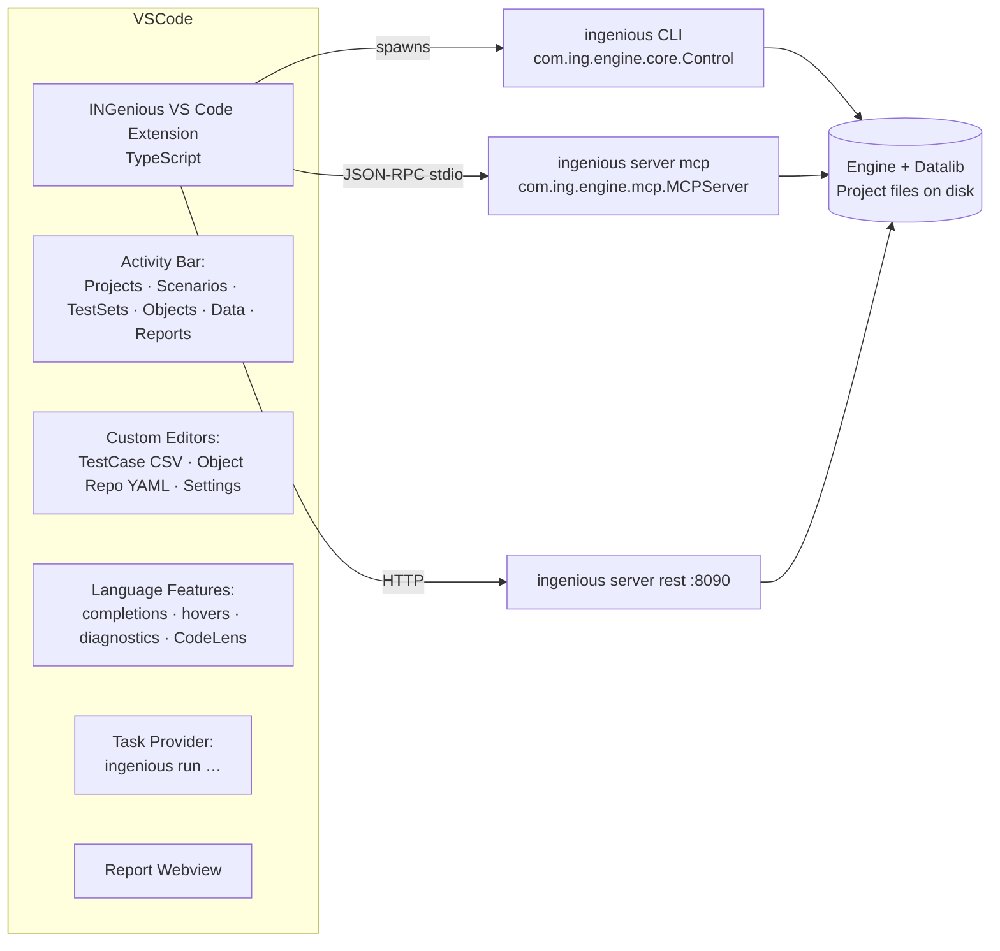

# INGenious VS Code Extension — Implementation Plan

> **Goal**
> Make the INGenious **Swing IDE optional** by delivering a first‑class
> authoring + execution + reporting experience inside **Visual Studio Code**.
> Users install the Engine (CLI) + the extension and never need the desktop
> IDE to design and run tests.

---

## Status update (2026 — plan re-baselined against current INGenious 3.1.x)

> **Most of the "required engine changes" this plan originally called for are
> already shipped.** This revision re-baselines the plan against the current
> codebase. Highlights of what already exists (so we do **not** rebuild it):
>
> - **MCP is a first-class, dedicated layer** in `com.ing.engine.mcp`
>   (`MCPServer` · `MCPTools` · `MCPToolFacade` · `MCPPrompts` · `MCPResources`),
>   not an inner class of `ServerCommand`. `ServerCommand` is now a thin Picocli
>   wrapper that delegates to `new MCPServer(projectPath, verbose).start()`.
> - **~96 MCP tools are registered** (project/scenario/testcase/testset/object/
>   data/action/run/report/config + generation, `perf` (k6), `apicollection`,
>   browser-discovery, `doctor`). The old "~14 tools, `listActions`/`getConfig`
>   stubbed" statement is obsolete — those are wired.
> - **Global `--json` / `--yaml` output** already exists via
>   [`OutputFormatter`](Engine/src/main/java/com/ing/engine/cli/output/OutputFormatter.java)
>   and the top-level `--json` flag on
>   [`INGeniousCLI`](Engine/src/main/java/com/ing/engine/cli/INGeniousCLI.java#L66).
> - **Object Repository is YAML now** (`ObjectRepository/Web/<Page>.yaml` via the
>   Datalib `ObjectRepository` model, `useYamlFormat=true`), auto-converting the
>   legacy `IOR.object` XML. Editors must target YAML, with read-only XML fallback.
> - **A `vscode-ingenious-bridge` extension already ships** in this repo — it is a
>   *different* extension that bridges VS Code Copilot models into INGenious's own
>   AI assistant / AI CLI over a local OpenAI-compatible endpoint. The extension in
>   this plan is the **authoring/execution/reporting** client and lives alongside
>   it (see §14).
> - An interactive **`ingenious ai`** ReAct CLI, `perf` (k6 Performance Studio),
>   `apicollection`, and 5 **skills** under `Resources/ai/skills/` also exist and
>   are surfaced by this plan (§1, §6).
>
> Net effect: **Phase P0 shrinks to a small audit** (schema-versioning + a couple
> of genuine gaps such as per-step run streaming), and the extension work (P1–P5)
> becomes the critical path.

---

## 0. Architecture at a glance



The extension does **no execution itself** — it always delegates to the
existing `com.ing.engine.core.Control` entry point via the CLI / MCP / REST
surfaces ([Engine/src/main/java/com/ing/engine/cli/INGeniousCLI.java](Engine/src/main/java/com/ing/engine/cli/INGeniousCLI.java),
[Engine/src/main/java/com/ing/engine/cli/commands/ServerCommand.java](Engine/src/main/java/com/ing/engine/cli/commands/ServerCommand.java)
which delegates to [Engine/src/main/java/com/ing/engine/mcp/MCPServer.java](Engine/src/main/java/com/ing/engine/mcp/MCPServer.java)).
In VS Code the MCP server is typically launched from a workspace `.vscode/mcp.json`
entry (auto-started on demand), so the extension can attach rather than spawn.
This keeps a single source of truth and means every feature you add to the
engine is available in VS Code on the next release.

---

## 1. Scope

### In scope (v1)
- Activity Bar with: **Projects · Scenarios · Reusables · Test Sets · Object Repository · Test Data · Reports**.
- Custom **CSV step editor** for `TestPlan/**/*.csv` and `ReusableComponents/**/*.csv`.
- Action **completion / hover / signature help** sourced from `ingenious action list|info`.
- Object Repository **picker + hover** sourced from `ingenious object list|show`.
- Test data **picker** sourced from `ingenious data list|show`.
- **CodeLens** above each test case: *Run · Debug · Dry‑run · Open last report*.
- **Task provider** wrapping `ingenious run testcase|testset|tags|rerun`.
- **Report webview** for `summary-v2.html` plus a tree of historical runs.
- **`.feature` file** authoring uses the existing Cucumber/Gherkin extensions; we contribute a *run* CodeLens only.
- **Project scaffolding** wizard (`ingenious project create`).
- **Status bar** items: current project, current environment, last run result, MCP server status.
- Output channels: `INGenious`, `INGenious – MCP`, `INGenious – Run`.
- **API Collections view** backed by `ingenious apicollection list|show|run` (the
  engine's `com.ing.engine.mcp.ApiCollectionStore` — Postman/Bruno-style collections).
- **Reuse the existing `vscode-ingenious-bridge`** (if installed) so the extension's
  AI features can drive INGenious via VS Code Copilot models with no API key (§14).

### In scope (v2)
- **Performance (k6) view** backed by `ingenious perf` (Performance Studio:
  export / validate / run / status / compare).
- **`ingenious ai` terminal profile** — one click to open the interactive ReAct
  CLI in a VS Code terminal for heavy multi-step authoring at low token cost.
- Object **recorder**: launch the Playwright/`@playwright/cli` discovery flow via
  the engine (`ingenious browser discover` / MCP `browser_session_*`) and
  materialise selectors back into the YAML Object Repository.
- Diff viewer for two runs (`ingenious report compare`).
- **Remote workspaces**: extension runs on the remote side; CLI must be present there.
- **Web UI** (option 4 in the parent plan) bundled via the REST server, reused inside a webview tab.

### Out of scope (intentionally)
- Re‑implementing the Swing IDE pixel‑for‑pixel.
- Bundling the JRE or Playwright browsers — the extension assumes a working `ingenious` CLI on `PATH` (with a one‑click installer button when missing).

---

## 2. File formats the extension must understand

All formats already exist on disk and are documented in the codebase:

| Concept | Path | Format | Authoritative reader |
|--------|------|--------|----------------------|
| Test case (steps) | [TestPlan/&lt;Scenario&gt;/&lt;TestCase&gt;.csv](Resources/Projects/Tutorial/TestPlan/API%20Testing/GetCustomer.csv) | CSV: `Step,ObjectName,Description,Action,Input,Condition,Reference` | `com.ing.datalib.component.TestCase` |
| Reusable component | `ReusableComponents/<Scenario>/<TestCase>.csv` | Same CSV schema | `com.ing.datalib.component.Scenario` (`Source.REUSABLE_COMPONENTS`) |
| BDD feature | `TestPlan/<Scenario>/*.feature` | Gherkin | StoryWriter module |
| Object repository | `ObjectRepository/Web/<Page>.yaml` (legacy [IOR.object](Resources/Projects/Tutorial/IOR.object)) | YAML (legacy XML auto-converted) | `com.ing.datalib.or.ObjectRepository` (`useYamlFormat=true`) |
| Test data | `TestData/*.csv`, `TestData/<env>/*.csv` | CSV | `TestData - Csv` module |
| Test set | `TestLab/<Release>/<Set>.csv` | CSV | `com.ing.datalib.testset` |
| Settings | `Settings/*.Properties`, `Settings/*.json` | properties/JSON | `Datalib` settings package |
| Reports | `Results/<Scenario>/<TestCase>/<timestamp>/summary-v2.html` + JSON | HTML+JSON | extentreport / FreeMarker |

The extension treats these as **the source of truth**; it does not maintain
a parallel cache.

---

## 3. Repository layout

```
ingenious-vscode/                  ← new top‑level repo (or sibling folder in this monorepo)
├── package.json                   ← extension manifest
├── tsconfig.json
├── esbuild.config.mjs
├── src/
│   ├── extension.ts               ← activate()/deactivate()
│   ├── client/
│   │   ├── cli.ts                 ← spawn ingenious, parse JSON output
│   │   ├── mcp.ts                 ← JSON-RPC stdio client
│   │   └── rest.ts                ← typed REST client (port 8090)
│   ├── model/
│   │   ├── project.ts
│   │   ├── testcase.ts            ← CSV row model
│   │   ├── action.ts              ← Action catalog typings
│   │   ├── object.ts              ← Object Repository (YAML) typings
│   │   └── report.ts
│   ├── views/
│   │   ├── projectsTree.ts
│   │   ├── reusablesTree.ts
│   │   ├── testSetsTree.ts
│   │   ├── objectsTree.ts
│   │   ├── dataTree.ts
│   │   └── reportsTree.ts
│   ├── editors/
│   │   ├── testCaseEditor.ts      ← CustomTextEditorProvider
│   │   ├── objectRepoEditor.ts    ← YAML Object Repository editor
│   │   └── settingsEditor.ts
│   ├── language/
│   │   ├── csvSemantics.ts        ← tokenize CSV rows
│   │   ├── completion.ts          ← action / object / data completion
│   │   ├── hover.ts
│   │   ├── diagnostics.ts         ← invokes `testcase validate`
│   │   └── codelens.ts            ← Run / Debug / Dry‑run
│   ├── tasks/
│   │   └── runTaskProvider.ts
│   ├── webview/
│   │   └── reportPanel.ts
│   ├── commands/
│   │   ├── runCommands.ts
│   │   ├── projectCommands.ts
│   │   ├── recordCommands.ts      ← v2
│   │   └── installCommands.ts     ← detect / install CLI
│   ├── status/
│   │   └── statusBar.ts
│   └── util/
│       ├── csvCodec.ts            ← RFC 4180 compliant (handles commas in Input)
│       ├── logger.ts
│       └── paths.ts
├── media/                         ← icons (SVG, light/dark variants)
├── syntaxes/                      ← TextMate grammar for .feature (already provided by another ext, optional)
├── snippets/
│   └── ingenious.csv.json         ← step skeletons per action category
├── schemas/
│   ├── action-catalog.schema.json ← shape returned by `action list --json`
│   └── object-repo.schema.json    ← YAML Object Repository page shape
└── test/
    ├── unit/                      ← Mocha
    └── integration/               ← @vscode/test-electron
```

---

## 4. Engine surface — what already exists vs. the remaining gaps

> **This section is re-baselined.** The bulk of the originally-planned engine
> work is already implemented. Below, each item is marked **✅ done**,
> **🟡 partial**, or **❌ gap**. Only the gaps are new engine work.

### 4.1 Stable JSON for `list`/`show`/`info` — 🟡 partial (audit only)
Global `--json` / `--yaml` already exist on
[INGeniousCLI](Engine/src/main/java/com/ing/engine/cli/INGeniousCLI.java#L66) and are
rendered by [OutputFormatter](Engine/src/main/java/com/ing/engine/cli/output/OutputFormatter.java).
The same data is also available as structured JSON through the MCP tools
(`action_list`, `object_show`, `testcase_show`, `report_show`, …), which the
extension should treat as the primary machine-readable source.

Remaining work is an **audit + schema-versioning pass**, not new plumbing:

- Confirm every `list|show|info` command honours `--json` (spot-check `report`,
  `testset`, `data`).
- Add a versioned schema doc under `Engine/src/main/resources/cli-schemas/`
  (`schemaVersion: 1`) so the extension can detect mismatches. The MCP
  `initialize` handshake already advertises tool schemas — reuse those shapes.

### 4.2 MCP tool surface — ✅ done (do NOT rebuild)
The MCP server is now a dedicated, unit-tested layer in
[com.ing.engine.mcp](Engine/src/main/java/com/ing/engine/mcp) — `MCPServer`
(JSON-RPC dispatch), `MCPTools` (~96 tools), `MCPToolFacade`, `MCPPrompts`,
`MCPResources`. `ServerCommand` just calls `new MCPServer(projectPath, verbose).start()`.
`listActions`/`getConfig` are wired to the real catalog (`ActionCatalog`).

Everything the original plan asked to "add" already ships, including:

- `object_list/show/search/add/update/delete/import_page`
- `data_show/get/set/row_add/column_add/import` + `env_list/create/delete`
- `testset_list/show/create/add`
- `report_latest/history/failures/show/compare/export`
- `testcase_validate` (validation)
- `run/run_async/run_status/run_logs/run_cancel/run_dry`
- generation: `gen_testcase/gen_from_openapi/gen_from_har/data_generate`
- `apicollection_*` (Postman/Bruno-style collections)
- `perf_*` (k6 Performance Studio)
- `browser_discover/session_start/do/snapshot/save/close`, `browser_inspect`
- `doctor`

In VS Code these appear as `ingenious_*` tools via the `ingenious` MCP server
(defined in `.vscode/mcp.json`). The extension consumes them directly — no new
tools required for v1.

### 4.3 REST server — 🟡 keep MCP-primary (unchanged recommendation)
`ingenious server rest` still exists (`ServerCommand.RestCommand`) but is not the
integration path for v1. **Recommendation stands: use MCP/stdio for v1**
(simpler, no port conflicts, matches the AI-agent model); promote a hardened
REST surface (embedded Jetty is already on the classpath) in v2 for the web-UI
host.

### 4.4 Streaming / live run progress — 🟡 partial (real gap = per-step NDJSON)
Live run *polling* already exists: `run_async` returns a `runId`, then
`run_status` + `run_logs` stream progress (see
[MCPTools.java](Engine/src/main/java/com/ing/engine/mcp/MCPTools.java#L292)). The
interactive `ingenious ai` CLI additionally streams per-step progress via
`com.ing.engine.aicli.execution.ExecutionListener`.

**Genuine gap:** a first-class **per-step NDJSON stream on `ingenious run … --stream`**
does not yet exist. If the extension wants real-time gutter decorations (§6.6)
rather than poll-based updates, add a `RunListener` that emits:
```json
{"event":"stepStart","step":3,"action":"Click","object":"loginBtn"}
{"event":"stepEnd","step":3,"status":"PASS","durationMs":124}
{"event":"runEnd","passed":12,"failed":0,"reportPath":"…/summary-v2.html"}
```
For v1 the extension can ship with `run_async` polling and add NDJSON later.

### 4.5 `doctor` — ✅ done via MCP (optional CLI alias)
`ingenious_doctor` already exists as an MCP tool (JDK, INGenious version,
Playwright/driver status, k6, project validation — see
[MCPTools.java](Engine/src/main/java/com/ing/engine/mcp/MCPTools.java#L1042)). The
extension's *Doctor* command calls that tool. Adding a top-level `ingenious doctor`
CLI subcommand (there is none today — see the subcommand list in
[INGeniousCLI.java](Engine/src/main/java/com/ing/engine/cli/INGeniousCLI.java#L24))
is a small, optional convenience.

---

## 5. Extension manifest (`package.json`) highlights

```jsonc
{
  "name": "ingenious",
  "displayName": "INGenious Test Automation",
  // NOTE: pick a publisher/name that does NOT collide with the existing
  // `vscode-ingenious-bridge` extension (publisher "local") already in this repo.
  "publisher": "ing-bank",
  "engines": { "vscode": "^1.85.0" },
  "categories": ["Testing", "Other"],
  "activationEvents": [
    "workspaceContains:**/Settings/RunSettings.Properties",
    "workspaceContains:**/ObjectRepository/**/*.yaml",
    "workspaceContains:**/IOR.object",
    "workspaceContains:**/.project",
    "onCommand:ingenious.project.create"
  ],
  "contributes": {
    "viewsContainers": {
      "activitybar": [{ "id": "ingenious", "title": "INGenious", "icon": "media/ingenious.svg" }]
    },
    "views": {
      "ingenious": [
        { "id": "ingenious.projects",  "name": "Projects" },
        { "id": "ingenious.testplan",  "name": "Test Plan" },
        { "id": "ingenious.reusables", "name": "Reusables" },
        { "id": "ingenious.testsets",  "name": "Test Sets" },
        { "id": "ingenious.objects",   "name": "Object Repository" },
        { "id": "ingenious.data",      "name": "Test Data" },
        { "id": "ingenious.reports",   "name": "Reports" }
      ]
    },
    "customEditors": [
      {
        "viewType": "ingenious.testCase",
        "displayName": "INGenious Test Case",
        "selector": [
          { "filenamePattern": "**/TestPlan/**/*.csv" },
          { "filenamePattern": "**/ReusableComponents/**/*.csv" }
        ],
        "priority": "default"
      },
      {
        "viewType": "ingenious.objectRepo",
        "displayName": "INGenious Object Repository",
        "selector": [
          { "filenamePattern": "**/ObjectRepository/**/*.yaml" },
          { "filenamePattern": "**/ObjectRepository/**/*.yml" },
          { "filenamePattern": "**/IOR.object" }
        ]
      }
    ],
    "taskDefinitions": [
      {
        "type": "ingenious",
        "required": ["mode"],
        "properties": {
          "mode":     { "type": "string", "enum": ["testcase","testset","tags","rerun"] },
          "target":   { "type": "string" },
          "project":  { "type": "string" },
          "browser":  { "type": "string" },
          "headless": { "type": "boolean" },
          "parallel": { "type": "number" },
          "env":      { "type": "string" },
          "tags":     { "type": "string" }
        }
      }
    ],
    "commands": [
      { "command": "ingenious.project.create",   "title": "INGenious: New Project" },
      { "command": "ingenious.project.open",     "title": "INGenious: Open Project Folder" },
      { "command": "ingenious.run.testcase",     "title": "INGenious: Run Test Case" },
      { "command": "ingenious.run.testset",      "title": "INGenious: Run Test Set" },
      { "command": "ingenious.run.tags",         "title": "INGenious: Run by Tags" },
      { "command": "ingenious.run.rerun",        "title": "INGenious: Re-run Failed" },
      { "command": "ingenious.report.openLatest","title": "INGenious: Open Latest Report" },
      { "command": "ingenious.cli.doctor",       "title": "INGenious: Doctor" },
      { "command": "ingenious.cli.install",      "title": "INGenious: Install / Update CLI" }
    ],
    "configuration": {
      "title": "INGenious",
      "properties": {
        "ingenious.cliPath":     { "type": "string", "default": "ingenious", "description": "Path to the ingenious launcher." },
        "ingenious.javaHome":    { "type": "string", "default": "", "description": "Optional JAVA_HOME override." },
        "ingenious.defaultBrowser": { "type": "string", "enum": ["Chrome","Edge","Firefox","Webkit"], "default": "Chrome" },
        "ingenious.headless":    { "type": "boolean", "default": false },
        "ingenious.mcp.autoStart": { "type": "boolean", "default": true },
        "ingenious.report.openOnRunEnd": { "type": "boolean", "default": true }
      }
    },
    "menus": {
      "view/title": [
        { "command": "ingenious.project.create", "when": "view == ingenious.projects", "group": "navigation" }
      ],
      "editor/title": [
        { "command": "ingenious.run.testcase",
          "when": "resourceFilename =~ /\\.csv$/ && resourcePath =~ /(TestPlan|ReusableComponents)/",
          "group": "navigation" }
      ]
    },
    "snippets": [
      { "language": "csv", "path": "./snippets/ingenious.csv.json" }
    ]
  }
}
```

---

## 6. Component‑level design

### 6.1 CLI client (`src/client/cli.ts`)
- Single `runCli(args: string[], opts?): Promise<{stdout,stderr,code}>` using `child_process.spawn`.
- Always appends `--json --no-color --quiet` when JSON is needed.
- Resolves `cliPath` from settings → workspace `Resources/ingenious{.bat|.command}` → `PATH`.
- If not found, raises a typed `CliNotInstalledError`; the activation handler shows a notification with the *Install CLI* button (downloads the latest CLI‑only zip from the upcoming GitHub release).
- A small **cache** (`Map<cmd, {data, ts}>`) with 5‑second TTL avoids hammering the JVM for completions.

### 6.2 MCP client (`src/client/mcp.ts`)
- Prefer **attaching to the MCP server declared in `.vscode/mcp.json`** (which
  auto-starts on demand in VS Code). Fall back to spawning
  `ingenious server mcp --verbose` when `ingenious.mcp.autoStart === true` and no
  server config is present.
- Implements newline‑delimited JSON‑RPC 2.0 against the stdio protocol in
  [com.ing.engine.mcp.MCPServer](Engine/src/main/java/com/ing/engine/mcp/MCPServer.java)
  (dispatch for the ~96 `ingenious_*` tools in
  [MCPTools.java](Engine/src/main/java/com/ing/engine/mcp/MCPTools.java)).
- Auto‑restart with exponential backoff on crash; surfaces status in the status bar.
- Exposes typed wrappers: `tools.testcaseShow(args)`, `tools.actionList()`,
  `tools.objectShow(args)`, `tools.doctor()`, etc. (generate the wrappers from the
  tool schemas returned by the MCP `initialize`/`tools/list` handshake).
- Used for *interactive* features (completion, hover, validation) and for the
  authoring generators (`gen_testcase`, `apicollection_*`, `browser_discover`).
  Falls back to CLI if MCP is unavailable.

### 6.3 CSV step editor (`src/editors/testCaseEditor.ts`)
- A `CustomTextEditorProvider` backed by a webview hosting a lightweight
  grid (e.g. **AG Grid Community** or hand‑rolled with `<table>` + CSS Grid).
- Two‑way binding to the underlying CSV TextDocument so plain‑text edits and
  external tools keep working. Every grid mutation produces a `WorkspaceEdit`
  applied to the document; the document drives the grid on `onDidChange`.
- Columns: `# · Object · Description · Action · Input · Condition · Reference`.
- Per‑cell editors:
  - **Action**: combobox populated from the cached action catalog; chosen action narrows valid `Object` page filter and prefills `Description`.
  - **ObjectName**: combobox grouped by OR page (`page › element`); supports *Create new object* inline.
  - **Input**: free text + autocompletion for `@`‑literals, `${variable}`, data references `$dataSheet[col]`.
  - **Condition**: dropdown of registered conditions (`if`, `loop`, `else if`, …).
- Toolbar: `+ Step`, `Insert above`, `Duplicate`, `Move ↑/↓`, `Delete`, `Run from here`, `Validate`.
- Bottom strip shows live diagnostics (count of warnings/errors) from §6.6.
- Honors VS Code theme via `var(--vscode-*)`.

### 6.4 Object Repository editor (`src/editors/objectRepoEditor.ts`)
- Webview‑based tree (page → object). Each object exposes:
  - Name, locator strategy and value. The YAML OR keys are the Datalib
    `WebOR.OBJECT_PROPS`: `role`, `text`, `label`, `placeholder`, `css`, `xpath`,
    `altText`, `title`, `testId`, `chainedLocator`, `jsPath` (plus `exact`).
  - Multiple alternate locators with reorder.
- Primary target is **YAML** at `ObjectRepository/Web/<Page>.yaml` (one file per
  page). Bind two‑way to the on‑disk YAML using a YAML codec (`yaml`), with a
  roundtrip test so untouched nodes keep their formatting. Prefer routing writes
  through the engine (`object_add/update/delete` MCP tools / `ingenious object`
  CLI) so the Datalib model stays authoritative; treat direct-file editing as the
  fallback. Legacy `IOR.object` XML is opened **read-only** (engine auto-converts
  it to YAML on first model load).
- "Discover in browser" button drives `browser_discover` / `browser_session_*`
  (v2) and materialises captured aria locators into the page YAML.

### 6.5 Language features for CSV (`src/language/`)
Activated for CSV files under `TestPlan/**` or `ReusableComponents/**`.

- **Completion** (`registerCompletionItemProvider`):
  - Column 4 (Action) → action list, filtered by typed prefix.
  - Column 2 (Object) → OR objects (from `object_list`/`object_search`), filtered by current `Action`'s page hint.
  - Column 5 (Input) → snippets per action (e.g. `Set` → `@<value>`), variable names, data‑sheet column names.
- **Hover**: hovering an action shows its description, parameters, examples (Markdown).
- **Signature help** inside `Input`: displays expected parameter list of the selected action.
- **Diagnostics**: on `onDidSaveTextDocument`, calls `ingenious testcase validate <…> --json` and surfaces row/column diagnostics. Throttled (500 ms debounce).
- **CodeLens** (`registerCodeLensProvider`):
  - Top of file: `▶ Run · 🐞 Debug · 🧪 Dry-run · 📊 Last report`.
  - Above each step row: `▶ Run from here · ✂ Insert above`.

### 6.6 Task provider (`src/tasks/runTaskProvider.ts`)
- Implements `vscode.TaskProvider` with type `ingenious`.
- Converts task definitions into CLI args:
  ```ts
  ['run', def.mode, ...(def.target ? [def.target] : []),
    '-p', def.project, '-b', def.browser ?? cfg.defaultBrowser,
    ...(def.headless ? ['--headless'] : []),
    ...(def.parallel ? ['--parallel', String(def.parallel)] : [])]
  ```
- For **live progress**, prefer the MCP `run_async` → `run_status`/`run_logs`
  polling loop (available today). If/when the `--stream` NDJSON gap (§4.4) is
  closed, switch to reading NDJSON line‑by‑line for lower latency. Either way:
  - Updates the **Test Results panel** (via the standard `TestController` API).
  - Decorates the running row in the CSV editor (gutter + colored row).
  - Updates the status bar (`Running 3/12 · 2 failed`).
- Exit code / final run status → task result.

### 6.7 Report webview (`src/webview/reportPanel.ts`)
- Reads `summary-v2.html` (already self‑contained with inlined assets, see
  the report‑template work in the workspace) and renders it inside a
  webview with `enableScripts: true`.
- A small JSON sidecar (`summary.json` if present, else parsed from HTML)
  drives a left‑hand outline of scenarios → test cases for quick navigation.
- Toolbar: `Open in browser`, `Export PDF` (delegates to `report export`),
  `Compare with…` (v2).

### 6.8 Status bar (`src/status/statusBar.ts`)
Five items, left to right:

| Item | Click action |
|------|--------------|
| `🟣 INGenious` | Show extension version + Doctor |
| `📁 Project: MyShop` | Quick‑pick to switch project |
| `🌐 env: qa` | Quick‑pick to switch environment |
| `🧪 Last: ✓ 12/12` | Open last report |
| `🔌 MCP: connected` | Restart MCP server |

### 6.9 Welcome / getting started
Use the standard `viewsWelcome` contribution so an empty workspace shows:

```
You don't have an INGenious project yet.
[ Create New Project ]
[ Open Existing Project ]
[ Install / Update CLI ]
[ Read the docs ]
```

---

## 7. Distribution & CLI bootstrap

The extension must work on a **fresh machine**.

1. **Detection** on activation: `ingenious --version --json` with 3‑second timeout,
   then a `doctor` health check (via the `ingenious_doctor` MCP tool) surfaced on
   the welcome page.
2. **Auto‑install** path (cross‑platform):
   - macOS/Linux: download the upcoming `ingenious-cli-<ver>.zip` from the GitHub release into `${globalStorageUri}/cli/`, set `ingenious.cliPath` to the launcher.
   - Windows: same, with `.bat` launcher.
3. **JDK check**: requires Java 17+. If missing, link to the [Microsoft Build of OpenJDK 17](https://learn.microsoft.com/java/openjdk/) (don't auto‑install). Show a once‑only modal.
4. **Playwright browsers**: lazily installed on first run via the engine's existing install hook; extension surfaces progress.

A future enhancement is to publish an **Extension Pack** that bundles the
"Microsoft Java Pack" + INGenious to give beginners a single click setup.

---

## 8. Testing strategy

| Layer | Framework | What it covers |
|------|-----------|----------------|
| Unit | Mocha + Sinon | CSV codec, YAML OR codec, CLI argv builder, MCP message framing |
| Integration | `@vscode/test-electron` | Activation, custom editor opens, task runs `run_dry`, completion produces expected items |
| End‑to‑end | Playwright on VS Code Insiders | Open Tutorial project → edit a step → run → assert PASS in report webview |
| Engine contract | JSON Schema validation in CI | Every `--json` command / MCP tool result validated against `cli-schemas/*.json` |
| Backwards compat | Frozen golden CSVs + YAML OR of `Resources/Projects/Tutorial` | Editor roundtrip must not modify unrelated bytes |

CI: GitHub Actions matrix (macOS/Linux/Windows × VS Code stable/insiders),
with the engine built from source via `mvn -pl Engine -am package -DskipTests`.

---

## 9. Security & privacy

- Spawn the CLI with `shell: false` and an explicit `argv`. Never interpolate user input into a shell string.
- Webviews use `Content-Security-Policy` with `nonce` and `vscode-resource:` only.
- Report HTML is rendered in a webview with no network access; the existing `summary-v2.html` is already self‑contained.
- Telemetry: **opt‑in only**, via the standard `vscode.env.isTelemetryEnabled`. No data is sent before the user enables it.
- Extension never reads `Settings/*.Properties` values that look like secrets (regex blocklist on `password|secret|token|key`) into telemetry or logs.

---

## 10. Phased delivery

| Phase | Duration target | Deliverables |
|------|-----------------|--------------|
| **P0 – Engine audit** | First (small) | §4.1 `--json`/schema-version audit (mostly done), §4.4 optional `--stream` NDJSON gap. §4.2 tools + §4.5 `doctor` already shipped — verify only. |
| **P1 – MVP extension** | Second | Activity bar tree, CSV plain‑text completion + hover + CodeLens, task provider (MCP `run_async` polling), report webview, status bar, welcome page |
| **P2 – Visual CSV editor** | Third | Custom editor (§6.3) with action/object/data pickers, snippets, validation panel |
| **P3 – Object Repository editor** | Fourth | Custom **YAML** OR editor (§6.4), inline create from CSV editor |
| **P4 – Test Results integration** | Fifth | `TestController` API, in‑editor gutter decorations, rerun‑failed |
| **P5 – v2 features** | Later | Browser discovery/recorder, report compare, Perf (k6) view, API Collections view, REST/web UI host, Extension Pack |

Each phase ships an independent `.vsix` and is usable on its own.

---

## 11. Acceptance criteria (definition of done for v1)

A user on a clean machine can:

1. Install the VS Code extension from the Marketplace.
2. Accept the prompt to install the INGenious CLI.
3. Run **INGenious: New Project → Web template** and pick a folder.
4. See the project in the **Projects** view; open `TestPlan/Login/Smoke.csv`.
5. Add a step via the visual editor using action autocomplete and an existing OR object.
6. Press the inline `▶ Run` CodeLens.
7. Watch step‑by‑step progress in the editor gutter and Test Results panel.
8. See the report webview open automatically when the run finishes.
9. Click `Re‑run failed` and observe only failing tests rerun.

All of the above must work on macOS, Linux and Windows with no Swing IDE installed.

---

## 12. Open questions to confirm before P1

1. Marketplace publisher — reuse `ing-bank` or a new org‑level publisher?
2. Distribution of CLI‑only zips: ship from existing `ing-bank/INGenious` releases or a dedicated `ingenious-cli` repo?
3. Should we **also** distribute a *VS Code‑bundled* container image (`ingenious-cli` + `code-server`) for browser‑only users?
4. License of the visual editor grid (AG Grid Community is MIT — confirm acceptable, otherwise hand‑roll).
5. Where do extension‑specific docs live — alongside the existing docs site at https://ing-bank.github.io/ingenious-doc/ ?

---

## 13. Sources of truth referenced

- CLI entry point: [Engine/src/main/java/com/ing/engine/cli/INGeniousCLI.java](Engine/src/main/java/com/ing/engine/cli/INGeniousCLI.java)
- Subcommands: [Engine/src/main/java/com/ing/engine/cli/commands/](Engine/src/main/java/com/ing/engine/cli/commands)
- MCP server wrapper (Picocli): [Engine/src/main/java/com/ing/engine/cli/commands/ServerCommand.java](Engine/src/main/java/com/ing/engine/cli/commands/ServerCommand.java)
- MCP protocol + tools (authoritative): [Engine/src/main/java/com/ing/engine/mcp/](Engine/src/main/java/com/ing/engine/mcp) (`MCPServer`, `MCPTools`, `MCPToolFacade`, `MCPPrompts`, `MCPResources`, `ActionCatalog`, `ApiCollectionStore`)
- Output formatter (`--json`/`--yaml`): [Engine/src/main/java/com/ing/engine/cli/output/OutputFormatter.java](Engine/src/main/java/com/ing/engine/cli/output/OutputFormatter.java)
- Interactive AI CLI (ReAct): [Engine/src/main/java/com/ing/engine/aicli/](Engine/src/main/java/com/ing/engine/aicli)
- Existing companion extension: [vscode-ingenious-bridge/](vscode-ingenious-bridge)
- Authoring skills: [Resources/ai/skills/](Resources/ai/skills)
- Test case CSV example: [Resources/Projects/Tutorial/TestPlan/API Testing/GetCustomer.csv](Resources/Projects/Tutorial/TestPlan/API%20Testing/GetCustomer.csv)
- Reusable example: [Resources/Projects/Tutorial/ReusableComponents/Operations/Pay.csv](Resources/Projects/Tutorial/ReusableComponents/Operations/Pay.csv)
- Object Repository (YAML) model: [Datalib](Datalib/src/main) `com.ing.datalib.or.ObjectRepository`; legacy XML example: [Resources/Projects/Tutorial/IOR.object](Resources/Projects/Tutorial/IOR.object)
- Existing CLI usage guide: [CLI_Override_Plan_And_Usage.md](CLI_Override_Plan_And_Usage.md)
- Postman/Bruno importer plan (reused by the same Reusables view): [INGenious_Postman_Bruno_Import_Implementation_Plan.md](INGenious_Postman_Bruno_Import_Implementation_Plan.md)
- Test Manager integration plan (run reporting consumer): [INGenious_TestManager_Integration_Implementation_Plan_FULL.md](INGenious_TestManager_Integration_Implementation_Plan_FULL.md)

---

## 14. Relationship to the existing `vscode-ingenious-bridge` extension

This repo already ships a **separate** VS Code extension,
[vscode-ingenious-bridge/](vscode-ingenious-bridge) (`publisher: "local"`,
v1.1.0). It is **not** the authoring extension described here — it solves a
different problem and the two are complementary:

| | `vscode-ingenious-bridge` (exists) | This plan's extension (new) |
|---|---|---|
| Purpose | Bridge VS Code Copilot models to INGenious's **own** AI assistant / `ingenious ai` CLI over a local OpenAI-compatible endpoint | Author, run, and report on tests directly inside VS Code |
| Mechanism | Local `express` server exposing `/v1/chat/completions`; a webview panel | Tree views, custom editors, task provider, MCP client, report webview |
| Runs tests? | No | Yes (delegates to the engine via MCP/CLI) |
| Depends on the engine MCP tools? | Indirectly (the INGenious AI side calls them) | Directly |

**Integration guidance:**

- **Do not fold the bridge into this extension.** Keep them as two extensions;
  optionally publish an **Extension Pack** that installs both.
- Avoid identifier collisions: pick a distinct `name`/`publisher` (the bridge
  uses `local.vscode-ingenious-bridge`), distinct command prefixes
  (`ingenious.*` here vs the bridge's), and a distinct activity-bar container id
  (the bridge uses `ingenious-bridge-explorer`).
- **Reuse, don't duplicate, the AI path.** When this extension needs LLM-backed
  authoring (e.g. "generate a test from this description"), it should prefer the
  in-engine generators/MCP tools (`gen_testcase`, `apicollection_*`,
  `browser_discover`) and, for heavy multi-step jobs, hand off to `ingenious ai`
  — which the bridge can already back with the user's Copilot models (no API
  key). See [docs/VS-CODE-RUN-AND-DEBUG.md](docs/VS-CODE-RUN-AND-DEBUG.md).
